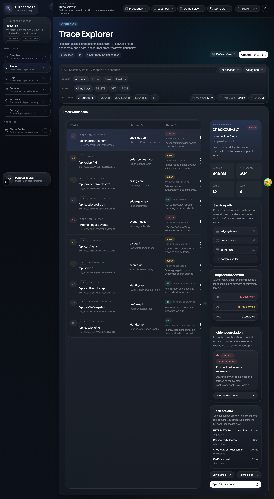
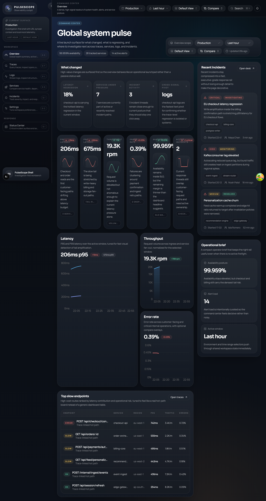
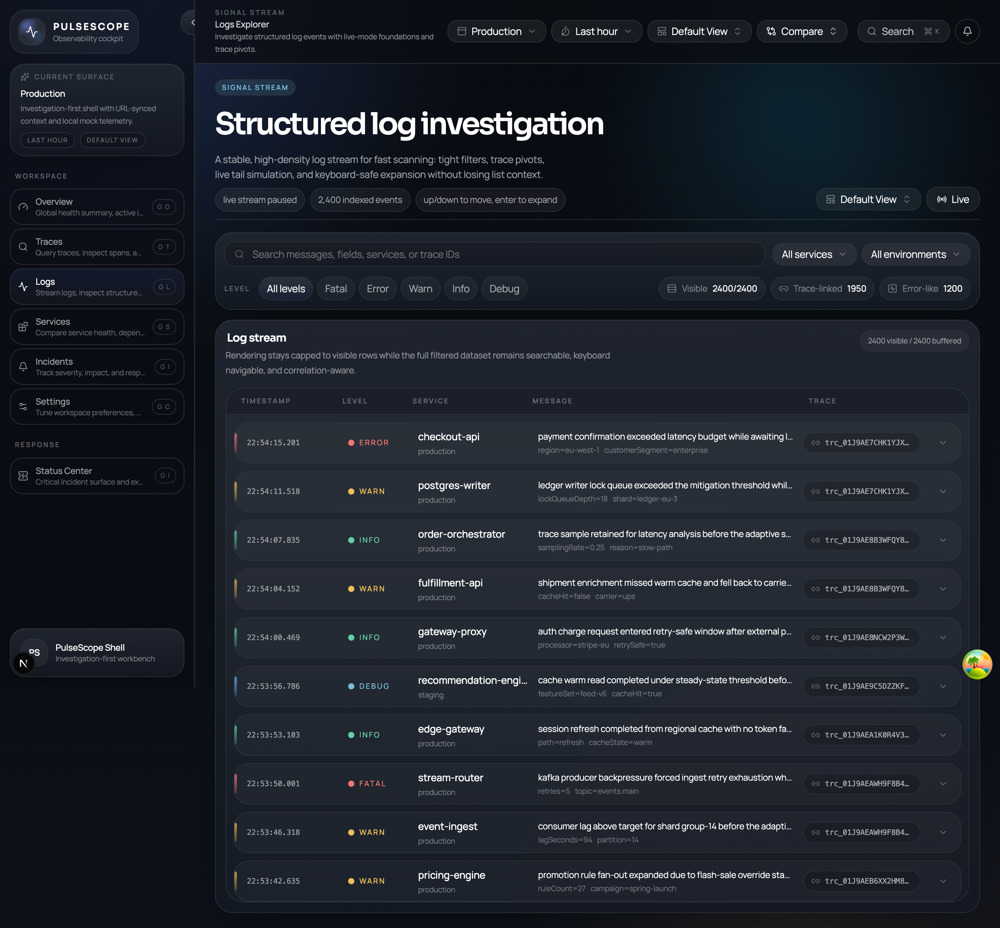

# PulseScope



Calm, investigation-first observability workbench with trace-first UX, correlated logs and incidents, URL-synced state, and portfolio-grade frontend polish.

PulseScope is built to feel like a real internal platform rather than a dashboard starter kit. It focuses on trace-driven investigation, dense operational UX, and the kind of polish expected from modern tools like Vercel, Linear, Datadog, and Grafana.

This repository is intentionally portfolio-grade. The goal is not to prove that a dashboard can be assembled quickly; it is to show how a serious frontend engineer structures a complex product surface, manages shared state, designs reusable primitives, and pushes quality across interaction design, testing, accessibility, and performance.

## Showcase

The cover image above is the flagship `Traces` surface in its latency-war-room configuration. The rest of the product is designed to support the investigation flow around it: overview -> anomaly -> service -> trace -> logs -> incident context.

| Trace Explorer | Trace Detail |
| --- | --- |
|  |  |
| Overview | Logs |
|  |  |

If you want the fastest review path locally, use this order:

- `/traces` for the flagship scanning surface
- `/traces/[traceId]` for the waterfall and investigation rail
- `/overview` for anomaly triage and cross-signal launch points
- `/logs` for dense virtualized stream behavior
- `/incidents` for the response-desk workflow

- dense but readable trace table
- right-side preview drawer
- URL-backed filters and sort state
- premium dark visual hierarchy designed for screenshot-level presentation

## What The Product Is

PulseScope is an observability cockpit for:

- overviewing system health
- drilling into traces and span waterfalls
- streaming structured logs
- comparing service posture
- coordinating incidents

The app is frontend-only and powered by typed local mock APIs, but it behaves like a real product:

- URL-synced filters and deep-linkable investigations
- command palette and keyboard shortcuts
- saved views and compare-range controls
- resizable investigative panels with persisted layouts
- polished loading, empty, and error states
- virtualization for large log datasets

## Why This Project Exists

Most frontend portfolio projects stop at attractive screenshots. PulseScope exists to demonstrate the harder part:

- building dense enterprise UX without collapsing into clutter
- creating reusable architecture instead of page-specific hacks
- treating loading, fallback, keyboard support, and state synchronization as first-class work
- shipping a product surface that feels expensive, stable, and intentional

The project is designed to be a centerpiece repo for senior frontend or full-stack roles where product judgment matters as much as code correctness.

## Tech Stack

- Next.js App Router
- TypeScript
- React
- Tailwind CSS
- shadcn-style UI primitives
- Framer Motion
- TanStack Query
- Zustand
- Recharts
- Vitest + Testing Library
- Playwright

## Local Development

```bash
npm install
npm run dev
```

Open [http://localhost:3000](http://localhost:3000).

Useful scripts:

- `npm run dev` starts the app locally
- `npm run lint` runs ESLint
- `npm run typecheck` runs TypeScript in no-emit mode
- `npm test` runs Vitest with coverage
- `npm run test:e2e` runs Playwright
- `npm run build` produces a production build

## Route Structure

| Route | Purpose |
| --- | --- |
| `/overview` | Global system pulse, KPI cards, charts, incidents, and slow endpoints |
| `/traces` | Flagship trace explorer with URL-backed filters, sort, and preview drawer |
| `/traces/[traceId]` | Deep investigation surface with waterfall timeline, span inspector, and related logs |
| `/logs` | Virtualized log stream with live mode, expansion, and trace correlation |
| `/services` | Service posture overview with health indicators, dependency panorama, and incident history |
| `/services/[serviceId]` | Detailed service dossier with trends, topology, and recent incidents |
| `/incidents` | Response desk with severity-led queue, detail drawer, and status timeline |
| `/settings` | Workspace-oriented shell preferences and control surface |

## Architecture

PulseScope is organized by product surface, not by framework convenience.

```text
app/
  Root layouts and route entrypoints
components/
  Shared layout, shell, chart, filter, table, and UI primitives
features/
  Route-focused modules for overview, traces, logs, services, and incidents
hooks/
  Shared interaction hooks such as keyboard shortcuts and workspace controls
lib/
  Navigation metadata, utilities, saved-view presets, URL state helpers, query keys, and mock APIs
store/
  Zustand-powered shell and workspace state
types/
  Shared domain and navigation types
tests/
  Unit, component, and end-to-end coverage
```

### Architectural Principles

- Thin route files, thick feature modules
- Shared primitives before bespoke page widgets
- UI state separated from data access patterns
- URL state for anything a user might want to share or revisit
- Typed mock APIs so frontend behavior resembles production contracts

## Product And Design Decisions

### 1. Trace-first information hierarchy

The traces explorer and trace detail page are the visual and architectural centerpieces. They establish the design language for the rest of the app:

- dense layouts without default admin-template spacing
- right-rail investigation patterns
- restrained motion and premium hover states
- context preserved while drilling deeper

### 2. Dark-first, typography-led UI

The interface relies more on spacing, border rhythm, contrast, and type scale than on loud color. Gradients are subtle and used for atmosphere or emphasis, not decoration.

### 3. Real shell behaviors, not fake chrome

The command palette, saved views, compare range controls, and keyboard shortcuts are not placeholders. They are wired into shared state and navigation so the shell behaves like a real product surface.

### 4. Deep-linking as a product feature

Investigative state is shareable:

- trace explorer filters are URL-backed
- selected spans on trace detail pages are deep-linkable
- selected incidents are deep-linkable
- log filters and expanded rows are URL-backed
- workspace context such as environment, time range, compare mode, and saved view can travel with navigation

## Performance Strategy

PulseScope is frontend-only, but it is structured as though the datasets are real and large.

- Virtualization is used for the log stream so large datasets remain smooth.
- TanStack Query provides stable caching semantics even against mock APIs.
- Query keys are typed and scoped by meaningful state.
- Deferred search input is used where it improves interaction smoothness.
- Resizable investigative layouts avoid remount-heavy page transitions.
- Shared UI primitives reduce duplicated render logic and styling drift.
- Page-level state was moved into URL and shell helpers where possible to avoid redundant local state trees.

## Accessibility Strategy

Accessibility is treated as part of product quality, not as cleanup work.

- keyboard shortcuts are built into the global shell
- visible focus styles are applied across buttons, inputs, table rows, menus, and span selections
- command palette actions are keyboard reachable
- skip link support is included for the main workspace content
- active navigation state is exposed with `aria-current`
- logs and incident selection flows remain keyboard-friendly
- empty and error states use semantic messaging instead of decorative placeholders

Areas with especially high attention:

- trace table row selection
- waterfall span selection
- logs row expansion and arrow-key navigation
- global topbar controls and menus

## Testing Strategy

The repo uses three layers of tests so the project feels like a serious engineering artifact rather than a demo.

### Playwright End-To-End

End-to-end coverage focuses on high-value product workflows:

- trace filtering
- row-to-detail navigation
- deep-linked span selection
- service detail navigation
- incident drawer selection
- log live mode
- command palette navigation
- saved-view preset application

Primary suite:

- [tests/e2e/pulsescope-shell.spec.ts](/Users/richard/Desktop/projects/front%20end/PulseScope/tests/e2e/pulsescope-shell.spec.ts)

### Vitest Unit Tests

Unit coverage focuses on logic that should stay correct even if the UI changes:

- URL state serializers/parsers
- workspace state helpers
- saved-view href generation
- navigation helpers
- store behavior
- waterfall math
- mock API contracts and filtering logic

Representative files:

- [tests/unit/workspace-state.test.ts](/Users/richard/Desktop/projects/front%20end/PulseScope/tests/unit/workspace-state.test.ts)
- [tests/unit/saved-views.test.ts](/Users/richard/Desktop/projects/front%20end/PulseScope/tests/unit/saved-views.test.ts)
- [tests/unit/traces-url-state.test.ts](/Users/richard/Desktop/projects/front%20end/PulseScope/tests/unit/traces-url-state.test.ts)
- [tests/unit/logs-url-state.test.ts](/Users/richard/Desktop/projects/front%20end/PulseScope/tests/unit/logs-url-state.test.ts)

### Testing Library Component Tests

Component tests focus on shared shell interactions where DOM behavior matters:

- command palette actions
- saved views menu behavior
- compare range menu behavior

Representative files:

- [tests/components/command-palette.test.tsx](/Users/richard/Desktop/projects/front%20end/PulseScope/tests/components/command-palette.test.tsx)
- [tests/components/saved-views-menu.test.tsx](/Users/richard/Desktop/projects/front%20end/PulseScope/tests/components/saved-views-menu.test.tsx)
- [tests/components/compare-range-menu.test.tsx](/Users/richard/Desktop/projects/front%20end/PulseScope/tests/components/compare-range-menu.test.tsx)

## Key Reusable Systems

### Workspace Controls

Shared workspace state lives behind URL-aware helpers and Zustand so navigation preserves context across the app.

- [use-workspace-controls.ts](/Users/richard/Desktop/projects/front%20end/PulseScope/hooks/use-workspace-controls.ts)
- [workspace-state.ts](/Users/richard/Desktop/projects/front%20end/PulseScope/lib/workspace-state.ts)
- [ui-store.ts](/Users/richard/Desktop/projects/front%20end/PulseScope/store/ui-store.ts)

### Shell UX

The shell is designed to feel like a real internal tool:

- [app-shell.tsx](/Users/richard/Desktop/projects/front%20end/PulseScope/components/layout/app-shell.tsx)
- [app-topbar.tsx](/Users/richard/Desktop/projects/front%20end/PulseScope/components/layout/app-topbar.tsx)
- [command-palette.tsx](/Users/richard/Desktop/projects/front%20end/PulseScope/components/layout/command-palette.tsx)
- [saved-views-menu.tsx](/Users/richard/Desktop/projects/front%20end/PulseScope/components/layout/saved-views-menu.tsx)
- [compare-range-menu.tsx](/Users/richard/Desktop/projects/front%20end/PulseScope/components/layout/compare-range-menu.tsx)

### Product Surfaces

The core feature modules are split by operational domain:

- [overview-shell.tsx](/Users/richard/Desktop/projects/front%20end/PulseScope/features/overview/components/overview-shell.tsx)
- [traces-explorer-shell.tsx](/Users/richard/Desktop/projects/front%20end/PulseScope/features/traces/components/traces-explorer-shell.tsx)
- [trace-detail-shell.tsx](/Users/richard/Desktop/projects/front%20end/PulseScope/features/traces/components/trace-detail-shell.tsx)
- [logs-explorer-shell.tsx](/Users/richard/Desktop/projects/front%20end/PulseScope/features/logs/components/logs-explorer-shell.tsx)
- [services-shell.tsx](/Users/richard/Desktop/projects/front%20end/PulseScope/features/services/components/services-shell.tsx)
- [incidents-shell.tsx](/Users/richard/Desktop/projects/front%20end/PulseScope/features/incidents/components/incidents-shell.tsx)

## Mock Data Approach

There is no backend in this repo by design. Instead, PulseScope uses typed local mock APIs so the frontend can be built against realistic data contracts now.

Benefits:

- allows UI architecture to mature before backend integration
- keeps data shape decisions explicit and testable
- makes loading, empty, and error states easy to simulate
- keeps the repo portable and easy to run in interviews or portfolio reviews

Mock APIs live in:

- [overview.ts](/Users/richard/Desktop/projects/front%20end/PulseScope/lib/mock-api/overview.ts)
- [traces.ts](/Users/richard/Desktop/projects/front%20end/PulseScope/lib/mock-api/traces.ts)
- [logs.ts](/Users/richard/Desktop/projects/front%20end/PulseScope/lib/mock-api/logs.ts)
- [services.ts](/Users/richard/Desktop/projects/front%20end/PulseScope/lib/mock-api/services.ts)
- [incidents.ts](/Users/richard/Desktop/projects/front%20end/PulseScope/lib/mock-api/incidents.ts)

## Future Roadmap

Areas that would make strong next milestones:

- richer saved-view authoring and persistence
- trace comparison mode inside the detail page
- more advanced dependency graphing and topology interactions
- bulk log actions, bookmarks, and multi-select workflows
- richer service-to-incident correlation surfaces
- accessibility audits with screen reader pass-through testing
- visual regression coverage for flagship surfaces
- optional backend integration or MSW-backed API contracts

## Repository Quality Bar

This project is meant to communicate a few things clearly:

- visual taste and product judgment
- architectural discipline
- respect for testing and maintainability
- comfort with dense enterprise UX
- ability to make mock data and local-first development feel real

If you are reviewing this repo as a hiring manager or teammate, the intention is simple: PulseScope should feel like a product someone could keep building, not a one-off demo.
